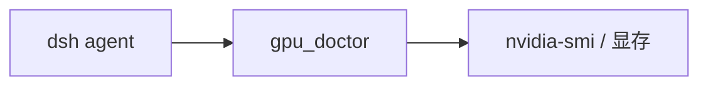

# dsh-wsl-gpu

> **套件安装：** 见 [dsh-wsl-kit](https://github.com/173787247/dsh-wsl-kit)。推荐 `KIT_SET=daily` | `llm` | `github` | `full`。故障树：[TROUBLESHOOTING.zh.md](https://github.com/173787247/dsh-wsl-kit/blob/master/docs/TROUBLESHOOTING.zh.md)。

DeepSeek Harness 工具：**`gpu_doctor`** — WSL 里查 `nvidia-smi`、显存压力、Blackwell/5080 提示，以及 Ollama / vLLM / Unsloth Desktop 是否抢同一张卡。

[English → README.md](./README.md)

## 在套件里的位置

报告 nvidia-smi、Blackwell 提示，以及推理端口是否已被占用。



整套关系图和版本快照：[dsh-wsl-kit 中文说明](https://github.com/173787247/dsh-wsl-kit/blob/master/README.zh.md)。本插件是 **0.2.2**（full，也在 llm）。不要把那份总表抄进本 README。


## 兼容性

| 项 | 值 |
|----|----|
| **插件** | `dsh-wsl-gpu` **0.2.2** |
| **最低 dsh** | ≥ **0.1.2**（Windows 中继 `:3081` 一次性 `?token=`） |
| **最新验证** | 以 [dsh-wsl-kit 兼容性](https://github.com/173787247/dsh-wsl-kit#compatibility-2026-09) 为准（当前 **`0.1.7-alpha.2`**）— 套件唯一真源 |
| **套件档位** | `llm` / `full`（也可单独装） |
| **云端 Flash** | settings / `llm-deepseek` 使用 **`deepseek-flash`**（V4.1 Flash）；本插件不配置模型 id |
| **Agent Teams** | 上游实验包；本插件不依赖 |

套件版本地板：[`check-plugin-versions.sh`](https://github.com/173787247/dsh-wsl-kit/blob/master/scripts/check-plugin-versions.sh)。故障树：[TROUBLESHOOTING.zh.md](https://github.com/173787247/dsh-wsl-kit/blob/master/docs/TROUBLESHOOTING.zh.md)。

## 为什么需要

本机推理靠 **Windows NVIDIA 驱动**把 GPU 透进 WSL2。一张约 16GB（如 5080）上同时开 Ollama + llama-server + vLLM 很容易 OOM。本工具一次给出可见性、显存和推理端口占用。

## 安装

```sh
curl -fsSL https://raw.githubusercontent.com/173787247/dsh-wsl-kit/master/install.sh | KIT_SET=llm bash
# 或：
dsh plugin --profile web add github:173787247/dsh-wsl-gpu
```

驱动更新、CUDA 编不过、再开大 GGUF 之前，让 agent 跑 `gpu_doctor`。

## 你会看到

- 解析后的 GPU：名称、驱动、已用/总显存、利用率、算力版本
- Blackwell / RTX 50 提示（`sm_120`、CUDA 12.8+/13.x）
- 推理端口：`11434` / `1234` / `8000` / `8080`
- 下一步可接 `host_reach`、`docker_doctor focus=vllm`

## 配置

```yaml
- id: dsh-wsl-gpu
  name: dsh-wsl-gpu
  config:
    timeoutMs: 20000
    probeTimeoutMs: 1200
    probeInference: true
```

## 测试

```sh
npm test
```

## 许可

MIT
